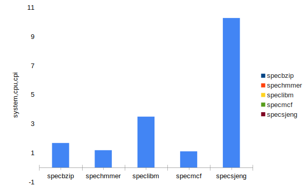

# 2η εργασία

1. Για τα 5 benchmarks που τρέξαμε τα στοιχεία της μνήμης cache που βρήκαμε στα αρχεία config.ini είναι τα εξής:
μέγεθος cache line: 64
L2 size: 2MB
associativity: 8
L1Data:
size: 64 KB
associativity: 2
L1Instruction
size: 32 KB
associativity: 2

2. Για το specbzip:
sim_seconds: 0.084159
CPI: 1.683172 
miss rate L1Instruction: 0.000074 
miss rate L1Data: 0.014840
miss rate L2: 0.281708    

 Για το spechmmer:
sim_seconds: 0.059368 
CPI:  1.187362   
miss rate L1Instruction: 0.000205   
miss rate L1Data: 0.001645 
miss rate L2: 0.082246   

 Για το speclibm:
sim_seconds: 0.174681 
CPI:   3.493611  
miss rate L1Instruction: 0.000099        
miss rate L1Data: 0.060971     
miss rate L2: 0.999927  

 Για το specmcf:
sim_seconds: 0.055477   
CPI:   1.109538
miss rate L1Instruction: 0.000037      
miss rate L1Data: 0.002051  
miss rate L2: 0.724040   

Για το specsjeng:
sim_seconds: 0.513541   
CPI:   10.270810
miss rate L1Instruction: 0.000020  
miss rate L1Data: 0.121829
miss rate L2: 0.999979 

3. Παρατηρούμε ότι στο σύστημα τα ticks ανά περίοδο είναι τα ίδια(1000).Αντιθέτως, στο clock του cpu στα 2 GHz έχουμε υποδιπλάσια ποσότητα ticks (500). Άρα ρυθμίζοντας τη συχνότητα, στην ουσία ρυθμίζουμε το "ρολόι" του επεξεργαστή. Έχοντας ρυθμίσει διπλάσια συχνότητα, παρατηρούμε ότι τα benchmarks "τρέχουνε" σχεδόν στον μισό χρόνο, αλλά και το CPI αυξάνεται κάτα ένα πολύ μικρό ποσοστό, σχεδόν αμελητέο. Αυτό συμβαίνει, γιατί ο επεξεργαστής είναι αρκετά πιο γρήγορος από τα υπόλοιπα στοιχεία πάνω στη motherboard, συνπώς αναγκάζεται να περιμένει. Παραδείγματος χάριν, αν έχεις ένα επεξεργαστή 1GHz και έναν των 2GHz είναι αρκετά πιθανό, ο δεύτερος να μη τρέχει το ίδιο πρόγραμμα στον μισό χρόνο που θα το έτρεχε ο πρώτος. Στην περίπτωση αυτή, όπως και στη δική μας, δεν έχουμε τέλειο scaling.  

Βήμα 2
1. 
Όλες οι παράμετροι ήταν δυνάμεις του 2 και δοκιμάσαμε διάφορες τιμές έως το μέγιστο εύρος των παραμέτρων, σε 5 δοκιμές ανά παράφοντα, κρίνοντας ότι ήταν ένα σχετικά κατάλληλο εύρος που θα μας έδειχνε πως κυμαίνεται ο CPI εξετάζοντας διαφορετικές ρυθμίσεις της μίας παραμέτρου, κρατώντας όλες τις άλλες σταθερές. Είναι σημαντικό να σημειωθεί ότι στις παραπάνω δοκιμές, οι σταθεροί παράμετροι του συστήματος, ήταν αυτοί που παρατηρήσαμε στο βήμα 1, τους οποίους θα επαναλάβουμε παρακάτω:
>μέγεθος cache line: 64
>L2 size: 2MB
>associativity: 8
>L1Data:
>size: 64 KB
>associativity: 2
>L1Instruction
>size: 32 KB
>associativity: 2

2. 

##Είναι σημαντικό να τονίσουμε ότι σε κάποια από τα γραφήματα ο CPI φαίνεται να έχει τιμή πάνω από 2 εκατομμύρια. Αυτό έγινε επιτηδευμένα για να μπορέσουμε να δούμε τις μικροδιαφορές στα γραφήματα. Εννοείται ότι είναι 2,χχχχχχ οι πραγματικές τιμές. Αναλυτικά, μπορείτε να τις δείτε στα αντίστοιχα αρχεία txt.

Παρατηρούμε ότι αλλάζοντας το μέγεθος του cacheline και κρατώντας όλες τις άλλες παραμέτρους σταθερές, το CPI μας μείωνεται σημαντικά, οπότε η προσομοίωση γίνεται πιο αποδοτικά.
Η σημαντικότερη αλλαγή του CPI γίνεται με την αυξομείωση του μεγέθους της cacheline, όπως βλέπουμε και στα γραφήματά μας, ενώ στους υπόλοιπους παράγοντες παρατηρούμε μικρές αυξομειώσεις κοντά στο 2,5 CPI. 

Βήμα 3
Υποθέτουμε αυθαίρετα ότι το κόστος διπλασιασμού της μνήμης cache μας L1 είναι τετραπλάσιο από το αντίστοιχο κόστος της L2 μνήμης cache. Επίσης, γνωρίζουμε ότι μια μεγάλη αύξηση του μεγέθους της cacheline θα κάνει το σύστημα εξαιρετικά πολύπλοκο, επομένως το κόστος υλοποίησης αυξάνεται πολύ γρήγορα συγκρτικά με τους υπόλοιπους παράγοντες. Υποθέτουμε αυθαίρετα 10πλάσιο κόστος διπλασιασμού του cacheline size, συγκριτικά με το αντίστοιχο κόστος της L2 μνήμης cache. Τέλος, αυθαίρετα υποθέσαμε ότι ο υποδιπλασιασμός του associativity των μνήμων cache, δεν επηρεάζει σημαντικά το κόστος.
Για να καταλήξουμε, στη βέλτιστη επιλογή των παραγόντων της μνήμης μας, θα προσέξουμε κυρίως το μέγεθος της cacheline, αφού  έχει το μεγαλύτερο κόστος από όλα, και επίσης τη μεγαλύτερη επίδραση στη συμπεριφορά του CPI. Θεωρούμε ότι είναι καλή η επιλογή του μεγέθους των 128 bytes. Είναι ίσως λίγο πιο ακριβή λύση, αλλά έτσι πετυχαίνουμε την μέγιστη απόδοση του CPI. Είναι εύλογο να συμπεράνουμε λοιπόν, ότι για το συγκεκριμένο benchmark που τρέξαμε, δηλαδή το speclibm, θα επιλέγαμε αυτούς τους παράγοντες:
>μέγεθος cache line: 128
>L2 size: 1MB
>associativity: 8
>L1Data:
>size: 32 KB
>associativity: 8
>L1Instruction
>size: 16 KB
>associativity: 8

Πηγές:
[Πηγή 1](https://www.aristeia.com/TalkNotes/ACCU2011_CPUCaches.pdf)
[Πηγή 2](https://www.csd.uoc.gr/~hy225/13a/handouts/lecture_caches-handout.pdf)
[Πηγή 3](https://en.wikipedia.org/wiki/Cache_placement_policies)
